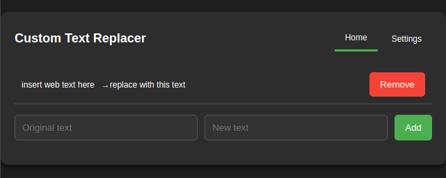

# Custom Text Replacer Chrome Extension

Custom Text Replacer is a Chrome Extension that allows users to define custom text replacement rules for web pages. With this extension, you can automatically replace specified phrases or words with alternatives that you set.

## Features

- Define custom text replacement pairs.
- Easy-to-use popup interface for managing your replacements.

## Installation

Drag the CRX into your Chrome, Chromium or Brave Extensions Page.

## Usage

After installing the extension, click on its icon in the Chrome toolbar to open the popup interface.

1. Enter the original text you want to replace in the "Original text" field.
2. Enter the new text you want it to be replaced with in the "New text" field.
3. Click the "Add" button to save the replacement rule.
4. Visit any webpage, and the extension will automatically replace the original text with the new text as specified.

To remove a replacement rule, click the "Remove" button next to the rule in the popup interface.

## Settings

You can customize the behavior of the extension by visiting the settings page:

- Enable or disable text replacement without removing your defined rules.
- More settings coming soon!

## Contributing

Contributions to Custom Text Replacer are welcome! Feel free to open an issue or submit a pull request.

## License

This project is licensed under the MIT License - see the [LICENSE](LICENSE) file for details.